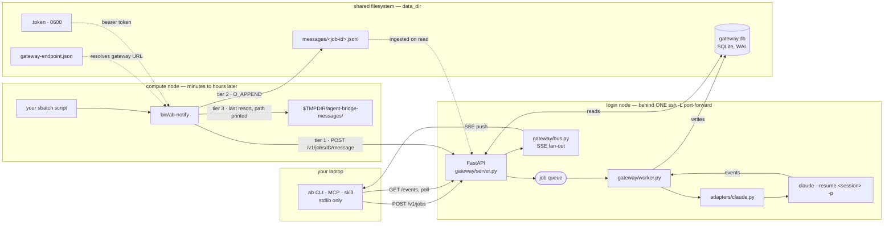

# agent-bridge

An HTTP gateway that accepts prompts, runs them through a coding agent in a
**named session** on a remote machine, and streams results back. Built for a
shared HPC login node: stdlib-only clients, localhost-bound, queue-worker model,
SQLite-backed logs you can **SSE-stream or poll**.

Claude Code and opencode are the current backends; each implements the same
adapter interface (`gateway/adapters/`), so a job names its backend with `agent`
and picks a model per job with `model`.

```
laptop ──POST /v1/jobs──▶ queue ──▶ worker ──▶ claude --resume <session>
   ▲                                                │
   │                                                ▼
   └── GET /v1/jobs/{id}/events ◀── SQLite ◀── events + result
                    ▲
                    └── ab-notify ◀── your sbatch, hours later
```

That last arrow is the point. A job's agent turn ends when it runs `sbatch`;
the actual compute then runs for hours with no connection to the gateway.
`ab-notify` lets the batch job report its own lifecycle into the same event
stream, so **one handle covers the whole thing**.

## Why it's shaped this way (login-node constraints)

- **Duo on every SSH login.** You can't open a fresh connection per task, so the
  gateway runs on the node behind **one** port-forward. One Duo push, then
  unlimited requests. (Windows has no `ControlMaster`, so a single forwarded
  port is the portable answer.)
- **Localhost bind + bearer token.** The node is multi-user. Reach it over the
  tunnel. (Exception: if you want `ab-notify`'s HTTP path to work from compute
  nodes, bind an internal address — see [Messages](#messages-from-batch-jobs).)
- **Server is FastAPI in a venv; clients are stdlib.** `run.sh` installs server
  deps on first launch. `client/` stays dependency-free.

## Architecture



Three things the picture is meant to make obvious:

- **No model sits in the request path.** Under the default
  `dispatch_mode = "direct"` the worker resolves the session itself and execs
  the agent. There is no dispatcher session choosing a fork target — see
  [How dispatch works](#how-dispatch-works).
- **Only the login node writes `gateway.db`.** WAL keeps its index in mmap'd
  shared memory, so every writer must be on one host. That is precisely why the
  compute-node fallback is an append-only JSONL file the gateway ingests, rather
  than a second writer.
- **The dotted arrows are discovery, not data.** `ab-notify` reads
  `gateway-endpoint.json` and `.token` out of the shared `data_dir`, which is
  how it reaches a gateway whose address it was never told — and how it knows to
  skip HTTP outright when the gateway is bound to loopback.

Events from all three sources land in one ordered stream, kept apart by
sequence band: worker events from **1**, HTTP messages from **1,000,000**,
file-ingested messages from **2,000,000**.

## Run it

On the login node, inside a persistent tmux:

```bash
ssh midway5                 # one Duo push
tmux new -s gw
cd /project/jevans/tzhang3/agent-bridge
cp config.example.toml config.toml   # then edit allowed_dirs
./run.sh
```

It prints the bearer token (auto-generated into `.token`). From your laptop:

```bash
ssh -o ServerAliveInterval=60 -o ServerAliveCountMax=3 \
    -L 8787:localhost:8787 midway5
```

The keepalives matter — an idle forward drops silently, and every client call
then fails with `connection refused` in a way that looks like the gateway died.
`autossh -M 0` with the same flags reconnects automatically.

### As a systemd user service

```bash
loginctl enable-linger $USER
mkdir -p ~/.config/systemd/user
cp systemd/agent-bridge.service ~/.config/systemd/user/
systemctl --user daemon-reload && systemctl --user enable --now agent-bridge
```

## API

Full reference: **[API.md](API.md)**.

| Method | Path | Purpose |
|---|---|---|
| GET  | `/health` | liveness (no auth) |
| GET  | `/llms.txt` · `/v1/help` | agent-facing contract, from live config (no auth) |
| GET  | `/v1/agents` | configured agent backends |
| GET  | `/v1/info?refresh=1` | host/CPU/RAM, GPUs, Slurm partitions, allocation balance |
| GET  | `/v1/sessions?cwd=&agent=` | the session index |
| POST | `/v1/jobs` | enqueue a prompt → `202 {id, title}` |
| GET  | `/v1/jobs?limit=N` | recent jobs |
| GET  | `/v1/jobs/{ref}` | job row |
| POST | `/v1/jobs/{ref}/message` | **a running batch job reporting in** |
| POST | `/v1/jobs/{ref}/cancel` | interrupt (SIGINT, like ESC) then escalate |
| GET  | `/v1/jobs/{ref}/events?after=N` | SSE stream, or one-shot JSON poll |
| POST | `/v1/files` · GET `/v1/files/list` · `/v1/files/content` | inputs and artifacts |

**`{ref}` is a full uuid, the job's title, or a unique id prefix.** An ambiguous
reference returns `409` with the candidates rather than guessing — which matters
most for `cancel`.

## How dispatch works

**Default `dispatch_mode = "direct"`: the caller names the session, and the
worker runs `claude --resume <session> -p` itself. No model decides routing.**

```bash
ab submit -F task.md --session <uuid>          # fork that session
ab submit -F task.md --session <uuid> --no-fork  # append to it in place
ab submit -F task.md                            # fresh session
```

The two older modes (`agent_exec`, `select_then_exec`) put a whole Claude
session in front of every job purely to *choose* a fork target. They remain
available in config, but they are not the default any more, because that design:

- is nondeterministic — routing varies run to run
- costs a full agent session per job
- **silently ignores `--model`**, since a fork inherits its parent's
- and, because forks inherit conversational context, trains sessions to reply
  *"I'll report back"* instead of doing the work

Name the session. If you don't have one, omit `--session` and get a fresh one.

## Choosing a backend and model

`agent` (the adapter: `claude` or `opencode`) and `model` are independent, so
any backend×model combo is selectable per job. The backend determines the tool
(Claude Code vs opencode); the model is what runs inside it.

```bash
ab models -g gw --agent opencode          # deepseek/deepseek-v4-flash, deepseek/deepseek-v4-pro
ab submit -g gw --agent opencode --model deepseek/deepseek-v4-flash -F task.md
ab run -g gw --agent opencode --model deepseek/deepseek-v4-pro "…"
ab run -g gw --agent claude --model claude-sonnet-5 "…"                # unchanged
```

`models` is a per-agent list in config.toml (`[agents.<name>] models = [...]`),
so `/v1/models` / `ab models` advertise exactly what each backend accepts:
claude's ids are `claude-*`, opencode's are `provider/model` (deepseek by
default).
`ab sessions --agent opencode` lists what the opencode adapter can fork;
`--agent claude` (default) lists Claude transcripts. opencode supports
`dispatch_mode="direct"` only; claude additionally offers the dispatcher modes.

## Messages from batch jobs

A job's agent turn ends at `sbatch`. Everything after that — queue wait, model
load, hours of compute — is invisible unless the job says something. Without
this you are reduced to guessing from output-file mtimes, which cannot tell
"queued" from "died before writing" from "I can't see the filesystem".

`bin/ab-notify` is executable and stdlib-only, so it needs no install — just put
it somewhere the batch job can find it. Either add the repo's `bin/` to `PATH`
inside the script, or symlink it once:

```bash
ln -s /path/to/agent-bridge/bin/ab-notify ~/.local/bin/ab-notify
```

Prefer the absolute path or an in-script `PATH` prepend if `~/.local/bin` on
your cluster already shadows things — stale console scripts there have caused
real failures.

From inside an sbatch script:

```bash
export PATH="/path/to/agent-bridge/bin:$PATH"
export AB_JOB_ID=<the ab job uuid>     # via #SBATCH --export=ALL,AB_JOB_ID=…
export AB_DATA_DIR=/path/to/agent-bridge
ab-notify --status running  --msg "vllm up, generating"
ab-notify --status finished --report "$RUNS/SWAP.md"
ab-notify --status failed   --msg-file "$RUNS/error.txt"
```

Those appear in `ab events <ref>` alongside the agent's own events.

### The HTTP path needs the bearer token

`ab-notify` resolves it as `--token` → `$AB_TOKEN` → `<data_dir>/.token`.
**`AB_DATA_DIR` is how it finds both the token and `gateway-endpoint.json`**, so
export it into the job — that one variable enables tier 1.

Without a token, HTTP is skipped and the message falls through to the shared
filesystem. That still works; you just lose immediate delivery and SSE push,
and `ab-notify`'s stderr will say `http: no token found`.

**Don't pass the token through `--export` or hardcode it in the script.** Job
environments and submit lines surface in scheduler metadata and accounting
records that other users on a shared cluster can often read. Reading `.token`
(mode `0600`, owned by you) from the shared data dir keeps the secret on disk
where the filesystem already protects it.

Three write paths, tried in order, so a message is never silently lost:

| | Target | Notes |
|---|---|---|
| 1 | `POST /v1/jobs/{id}/message` | immediate; published to the bus so SSE sees it |
| 2 | `<data_dir>/messages/<jobid>.jsonl` | shared filesystem; ingested on read |
| 3 | `${TMPDIR}/agent-bridge-messages/<jobid>.jsonl` | last resort, path printed |

### How `ab-notify` finds the gateway

**It never assumes loopback.** On a compute node `127.0.0.1` is *that node*, so
a loopback default would fail every call after burning a connect timeout.

At startup the gateway writes `<data_dir>/gateway-endpoint.json` — the same
shared directory `.token` already lives in:

```json
{ "bound": "10.50.251.129", "port": 8787,
  "fqdn": "midway3-login5.rcc.local",
  "url": "http://midway3-login5.rcc.local:8787" }
```

`ab-notify` resolves the URL as `--url` → `$AB_URL` → that file. If the gateway
is bound to loopback it writes `"url": null` plus a note explaining why, and
`ab-notify` **skips HTTP immediately** rather than timing out — falling straight
to the shared filesystem.

So tier 1 is available only when `[server] host` is an internal address. Keeping
it loopback-only is a supported choice; you just lose immediate delivery and SSE
push for messages.

**Batch jobs must never write `gateway.db` directly.** It runs in WAL mode,
whose index is mmap'd shared memory and therefore requires every writer on one
host. Appending JSONL with `O_APPEND` needs no locking at all, which is why the
fallback is a file and the gateway ingests it.

## Skills — both ends of the contract

[`skills/`](skills/README.md) ships two agent skills, written to agree
with each other and backend-agnostic (they work whether the gateway runs
Claude Code or opencode):

```bash
mkdir -p ~/.claude/skills
cp -r skills/agent-bridge-client ~/.claude/skills/     # the machine you work from
cp -r skills/agent-bridge-worker ~/.claude/skills/     # the gateway host
```

The division of labour is the point: **the local session plans and reviews with
a human; the remote agent investigates and executes.** The worker skill also
forbids the failure that costs the most time — ending a turn with *"I'll report
back when the job finishes"*, which the gateway records as success with no
deliverable, because a `claude -p` turn cannot hold a blocking wait.

Neither needs a restart; both take effect on the next session. Install them
before relying on batch reporting — the conventions are what make a job's
progress visible at all.

## Cancel

`POST /v1/jobs/{ref}/cancel` **interrupts** rather than killing: `SIGINT` to the
whole process tree — the equivalent of pressing ESC — so the agent stops its
turn, flushes its transcript, and exits, leaving the session resumable. Only if
it hasn't wound down within `[worker] cancel_grace_sec` (default 15s) does it
escalate to `SIGTERM`, then `SIGKILL`. `SIGKILL` leaves the transcript
mid-write, which is what makes a killed session awkward to pick up again.

## Configuration

See `config.example.toml`. Key knobs: `worker.concurrency` (mind sshd's
`MaxSessions` and API cost), `agents.claude.allowed_dirs` (cwd allowlist),
`dispatch_mode`, `messages.dir`, `cancel_grace_sec`, `timeout_sec` (`0` = no
limit). Any scalar is overridable via `AGENT_BRIDGE_<SECTION>_<KEY>`.

## Files (inputs & artifacts)

- **Upload + submit in one call** — `POST /v1/jobs` takes a `files` array (JSON
  inline or `{path}` refs) or multipart. Uploads land in a per-user `0700` store
  and are surfaced to the agent as *ATTACHED FILES*.
- **Fetch artifacts** — `GET /v1/files/list?dir=&glob=` then
  `GET /v1/files/content?path=`.
- **Large data** → `rsync` into an allowed dir and pass `{"path": …}`.

CLI: `ab upload` / `ab download` / `ab ls`, or `--upload`/`--file` on submit.

## Local clients

Stdlib-only, sharing one transport (`abclient.py`). See
[client/README.md](client/README.md).

```bash
python3 client/ab.py jobs                       # recent jobs, full ids + titles
python3 client/ab.py submit -F task.md --title nightly --session <uuid>
python3 client/ab.py events nightly --follow    # by title
python3 client/ab.py download --dir /project/.../out --glob '*.csv' --to ./out
```

## Recovering a job's output when the API can't help

Session transcripts live on disk and are readable through `ab ls`/`ab download`:

```
/home/<user>/.claude/projects/-project-<slug>/<session-id>.jsonl
```

Transcript size doubles as a liveness signal (still growing = still working),
and the file is the result channel for a job whose text you can't otherwise
retrieve. Useful when a job row is stale or a run wrote no files.

## Adding an agent backend

Implement `list_sessions()` and `run(spec, emit)` in
`gateway/adapters/<name>.py`, register it in `adapters/__init__._REGISTRY`, and
add a `[agents.<name>]` section (with a `models = [...]` list) to config.toml.
Queueing, persistence, SSE and auth are handled for you. `claude`
and `opencode` are registered; `antigravity` is the next placeholder.

## Caveats

- **One login node.** `midway3.rcc` round-robins, so target `midway3-login5`
  explicitly. Systemd + linger brings the gateway back after a reboot.
- **`claude` auth must be non-interactive.** Runs reuse `~/.claude`; if that
  expires, jobs fail until you re-auth.
- **`opencode` auth lives in opencode's own store** (`~/.local/share/opencode`,
  or `opencode auth login`), not an env var — so opencode jobs just work once
  you've logged in on the gateway host.
- **Login nodes are for light work.** Keep `concurrency` low; submit real
  compute to Slurm from inside a job.
- **`bypassPermissions`** lets the agent edit and execute freely inside
  `allowed_dirs`. Scope that list deliberately.
- **A stale `running` row is not proof of life.** A job whose session died on a
  usage limit can sit in `running` indefinitely. Cross-check the session or a
  recent `ab-notify` message.
